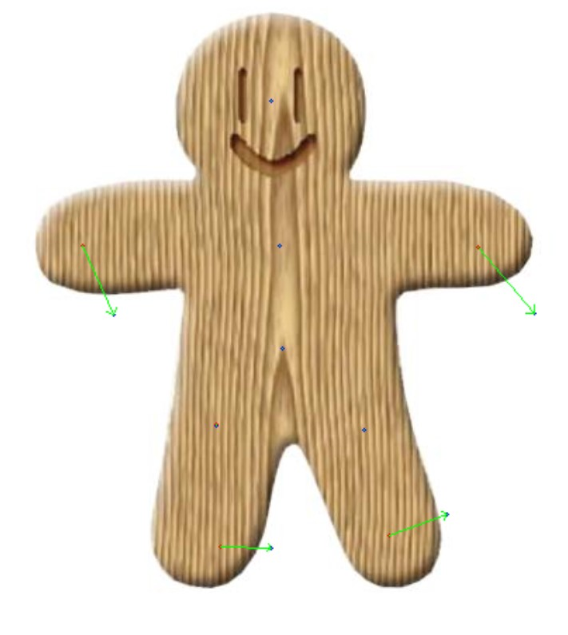
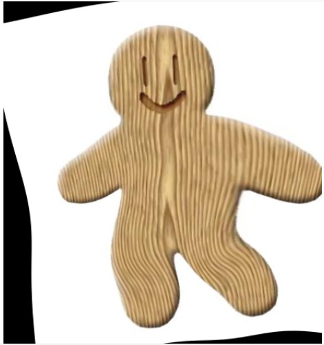
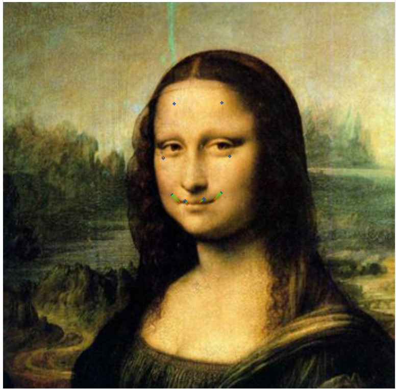
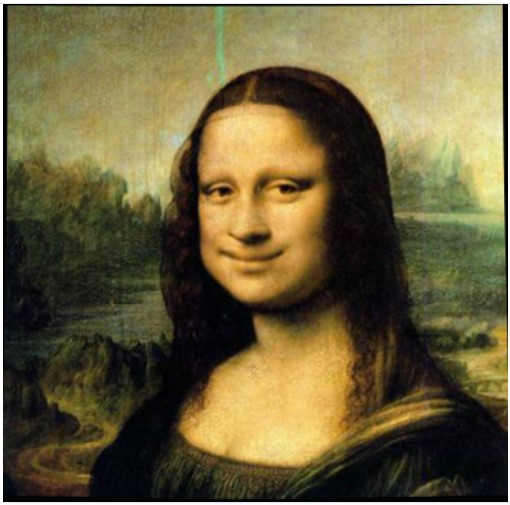
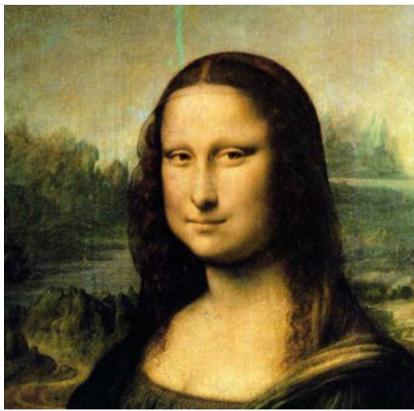

# HW1 - Image Warping

## Installation
To install requirements:  
`python -m pip install -r requirements.txt `

## Running
To run **basic transformation**, run:  
`python run_global_transform.py `

To run **transformation guided by points**, run:  
`python run_point_transform.py`

## Results
### 1.Basic transformation
[<video width="300" height="200" controls>
    <source src="./assets/basic_transform.mp4" type="video/mp4">
</video>](https://github.com/user-attachments/assets/18d24f5f-e7d0-4cdc-9136-4214e357ab66)

### 2.transformation guided by points
关于算法的具体原理可以阅读**实验报告**进行了解，下面是采取相似变换方法获得的结果。
<figure class = "half">

</figure>

<figure class = "half">

</figure>

<figure class = "half">

</figure>

## References
[Image Deformation Using Moving Least Squares](https://people.engr.tamu.edu/schaefer/research/mls.pdf)
