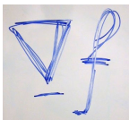

# Poission Blending

## Installation
To install requirements:  
`python -m pip install -r requirements.txt`

Then click [Pytorch](https://pytorch.org), install pytorch-cuda=12.1

## Results
<figure class = "half">

</figure>

## Reference
