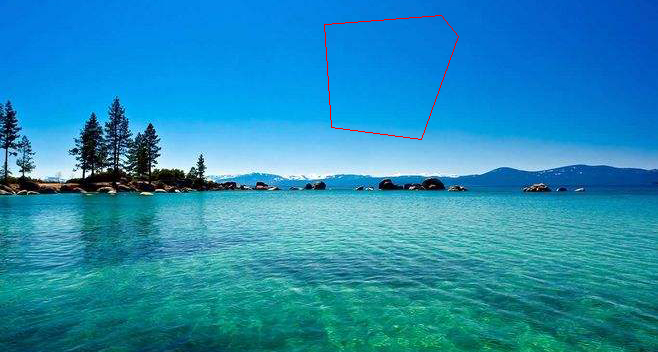
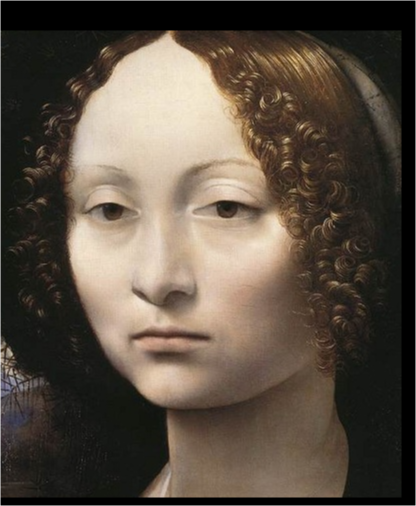
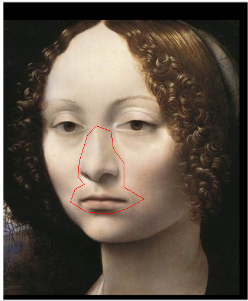
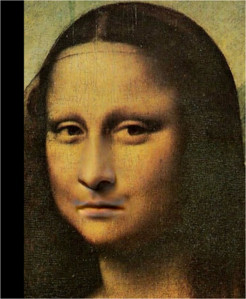

# Poission Blending

## Installation
To install requirements:  
`python -m pip install -r requirements.txt`

Then click [Pytorch](https://pytorch.org), install pytorch-cuda=12.1

## Results

### 1.将方程式融合到天空背景中：
<figure class = "half">

</figure>

<figure class = "half">

</figure>

### 2.蒙娜丽莎：
<figure class = "half">

</figure>

<figure class = "half">

</figure>

## Reference
