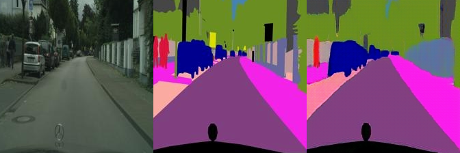

# Pix2Pix by CGAN

## Installation
To install requirements:  `python -m pip install -r requirements.txt`

Then click [Pytorch](https://pytorch.org), install pytorch-cuda=12.1

## Datasets
To prepare the datasets(you can choose one dataset):  
`bash download_cityscapes_dataset.sh`

## Train
To train the model:  
`python train.py`

## Results

1.采用U-net架构构建Generator，损失函数：L1范数，训练800轮次：
<figure class = "half">

</figure>

<figure class = "half">

</figure>

2.采用U-net架构构建Generator，损失函数：L1+CGAN，训练4500轮次：
<figure class = "half">

</figure>

<figure class = "half">

</figure>

3.采用残差块构建Generator，损失函数：L1+CGAN，训练900轮次：
<figure class = "half">

</figure>

<figure class = "half">

</figure>
