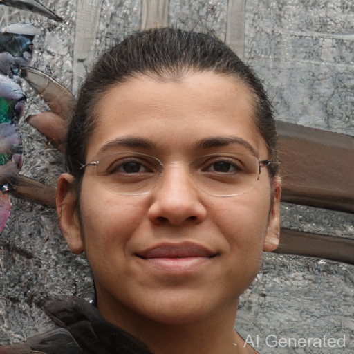

# Face_Drag

## Installation

### 2.install DragGan
`git clone [https://github.com/XingangPan/DragGAN.git]`  
`conda env create -f environment.yml`  
`conda activate stylegan3`  
`pip install -r requirements.txt`  

### 1.install face_alignment

`git clone [https://github.com/1adrianb/face-alignment.git]`  
`conda activate stylegan3`  
`pip install -r requirements.txt`  
`python setup.py install`  

## Run
download face_drag.py in the DragGAN  
`conda activate stylegan3`  
`python face_drag.py`

## Results

原始人像
<figure class = "half">

</figure>

瘦脸：
<figure class = "half">

</figure>

微笑：
<figure class = "half">

</figure>

大眼：
<figure class = "half">

</figure>

